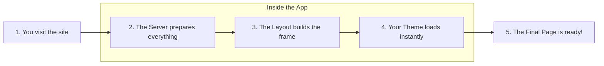

# Modern Enterprise Portfolio | Next.js Architecture

This repository contains a production-grade portfolio application built with the **Next.js 16 (App Router)**, **TypeScript**, **Redux Toolkit**, and **Tailwind CSS v4**. It features a comprehensive multi-theme system and an enterprise-level folder structure.

---

## 💡 How it Works (Simply Explained)

1.  **The Start**: When you visit the website, **Next.js** (the engine) quickly prepares the page on the server and sends it to your browser.
2.  **The Setup**: As soon as the page arrives, two "helpers" wake up:
    *   **Redux**: Remembers your data across the site.
    *   **ThemeProvider**: Checks which theme you previously picked (like Dark or Forest) and applies it instantly.
3.  **The Layout**: The **Navbar** and **Footer** stay the same as you move through different pages, making the site feel fast and smooth.
4.  **The Interaction**: When you click the **Theme Palette**, the site swaps out a set of "CSS variables" (color rules) for the entire page. Because of the way we've built it, this happens instantly without refreshing the page!

---

## 🚀 How the App Runs (Step-by-Step)

The diagram below shows the journey your browser takes from the moment you type the URL to seeing the final, beautiful page.



### Breakdown of the Steps:

1.  **Entry Point**: You visit the root URL `/`.
2.  **Redirect & Prepare**: The app immediately moves you to the `/home` page and the server gathers all the necessary styles and code.
3.  **Building the Frame**: The **Navbar** and **Footer** are placed first to make the site structure solid.
4.  **Applying the Style**: The app check which theme (Light, Dark, Forest, etc.) you prefer and instantly "paints" the entire page with those colors.
5.  **Final Render**: Your interactive components (like buttons and animations) wake up and the site is fully usable!

---

## 📂 Core Architecture (What, Why, How, Impact)

### 1. `app/layout.tsx`
- **What**: The root layout of the entire application.
- **Why**: To provide consistent context across all pages and avoid layout shifts.
- **How**: Wraps `{children}` with `ReduxProvider` and `ThemeProvider`.
- **Impact**: Centralizes global state and theme management at the highest level of the DOM.

### 2. `app/globals.css`
- **What**: Primary stylesheet using Tailwind CSS v4.
- **Why**: To define the design system's tokens and custom themes.
- **How**: Uses `@theme` for mapping Tailwind utilities to CSS variables (`--primary`, `--background`, etc.) and sets them within `[data-theme='...']` selectors.
- **Impact**: Enables complex multi-theme support (Forest, Ocean, Sunset) with zero-latency switching.

### 3. `providers/ThemeProvider.tsx`
- **What**: Client-side wrapper for `next-themes`.
- **Why**: To handlehydration and synchronization between stored theme preference and system settings.
- **How**: Configures `attribute="data-theme"` and explicitly enables all custom theme names.
- **Impact**: Prevents "flashes of unstyled content" (FOUC) and manages the DOM attribute on the `html` element.

### 4. `components/common/ThemeSwitcher.tsx`
- **What**: Interactive theme selection UI.
- **Why**: To give users control over the visual experience.
- **How**: Utilizes `useTheme` hook to broadcast theme changes and Framer Motion for premium dropdown animations.
- **Impact**: Wows the user with a sleek, premium interaction and demonstrates advanced React state handling.

### 5. `app/(public-routes)/home/page.tsx`
- **What**: The landing page of the portfolio (SSG).
- **Why**: To deliver peak performance and SEO results.
- **How**: Static Server Component that renders high-impact sections using the `bg-background` and `text-foreground` tokens.
- **Impact**: Maximizes Core Web Vitals (LCP, FID) by shipping minimal JavaScript for the initial view.

---

## 🎨 Theme Implementation Details

The application supports five premium themes, each affecting the entire page including the background, typography, and card elements.

| Theme Name | Primary Color | Background Color | Mood |
|:---|:---|:---|:---|
| **Light** | Blue-500 | Pure White | Professional / Clean |
| **Dark** | Blue-300 | Deep Navy | Sleek / Focus |
| **Forest** | Emerald-500 | Deep Green | Nature / Growth |
| **Ocean** | Sky-500 | Marine Blue | Fluid / Calm |
| **Sunset** | Violet-500 | Royal Purple | Warm / Creativity |

---

## 🛠️ Tech Stack & Patterns

- **Framework**: [Next.js 16 (App Router)](https://nextjs.org/)
- **Styling**: [Tailwind CSS v4](https://tailwindcss.com/) (using CSS Variables)
- **State**: [Redux Toolkit](https://redux-toolkit.js.org/)
- **Animations**: [Framer Motion](https://www.framer.com/motion/)
- **Icons**: [Lucide React](https://lucide.dev/)
- **Typography**: [Inter Font Family](https://fonts.google.com/specimen/Inter)

---

## ⚙️ Development

```bash
npm install
npm run dev
```
Open [http://localhost:3000](http://localhost:3000) to view the application.
